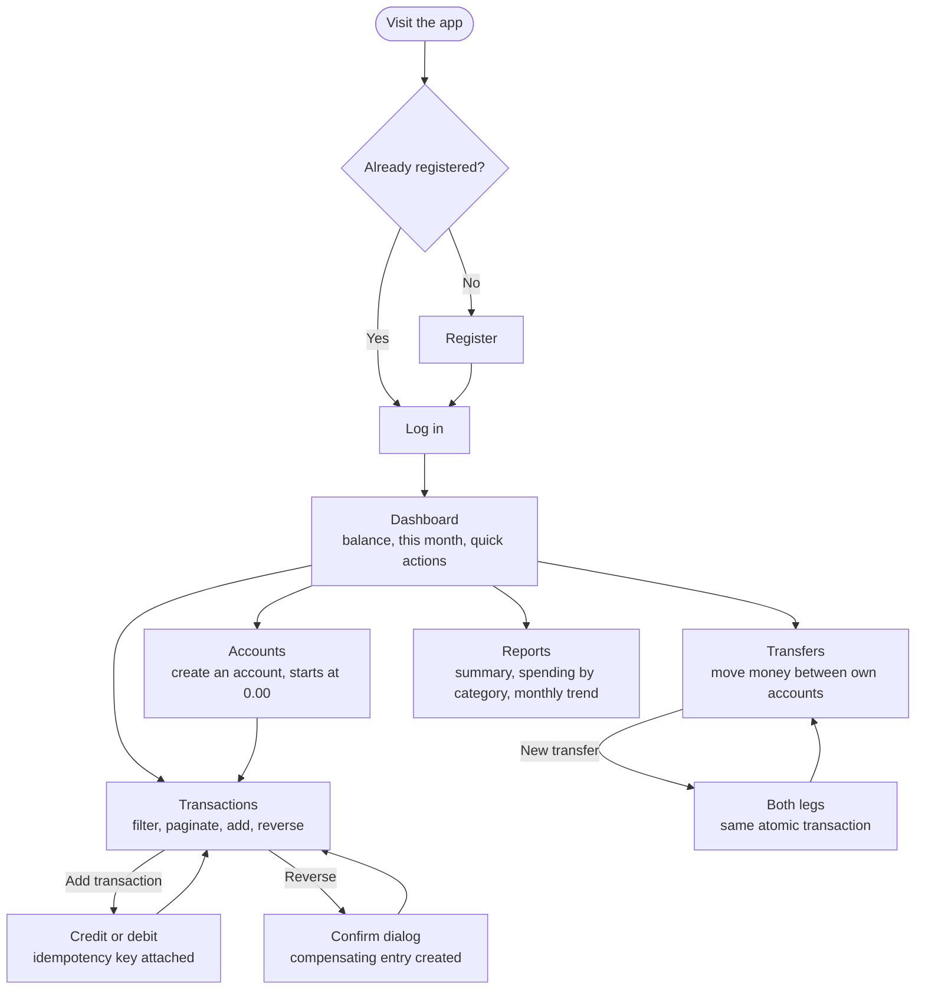
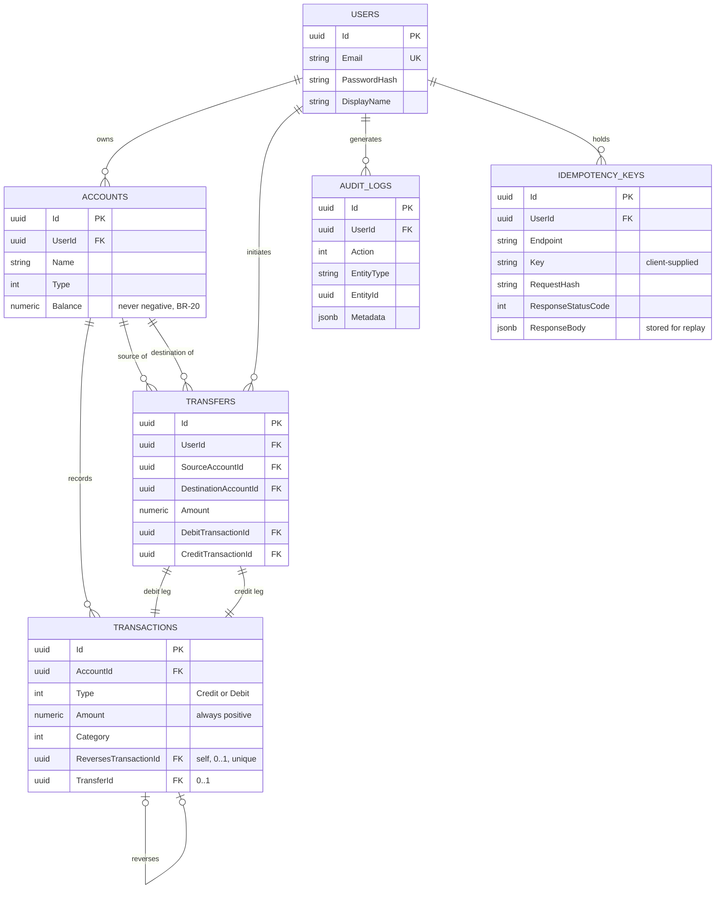

# Mini Transaction Ledger

Every entry in this ledger is permanent. Balances move by adding new
transactions, never by editing old ones — a debit, a credit, a transfer, a
reversal, each one an honest fact that stays on the record. It's a small
financial system built the way a real one has to be: money handled as exact
decimals, concurrent transfers that can't deadlock, retried requests that
can't double-charge, and a history nothing can quietly rewrite.

**Stack**

- **Backend** — ASP.NET Core 9 Web API, Entity Framework Core 8
- **Database** — PostgreSQL 16
- **Frontend** — Next.js 16, TypeScript
- **Testing** — xUnit, Testcontainers
- **Containerization** — Docker, Docker Compose

---

## What it does

- **Accounts** — cash, savings, business, wallet. Every account starts at
  `0.00` and is funded by recording a credit.
- **Transactions** — credits and debits against one account, categorised,
  searchable, filterable, paginated in SQL.
- **Transfers** — money moved between two of your own accounts in a single
  database transaction: both balances change, or neither does.
- **Reversals** — the only way to correct a mistake. A reversal is a new
  compensating entry; the original row is never edited or deleted.
- **Reports** — balance, credits/debits/net, spending by category, and a
  month-by-month comparison, all aggregated by PostgreSQL.
- **Audit log** — every balance-affecting action is recorded in the same
  transaction as the action itself.

Two properties are load-bearing and worth stating up front:

- **The ledger is append-only.** There is no `PUT` and no `DELETE` anywhere in
  the API. History cannot be rewritten, only added to.
- **Money-moving requests are idempotent.** `POST /api/transactions` and
  `POST /api/transfers` require an `Idempotency-Key`; a retried request
  replays the original response instead of moving the money twice.

---

## Running it

### The one command

```bash
git clone <repo-url> && cd Mini-Transaction-Ledger
cp .env.example .env      # edit POSTGRES_PASSWORD and JWT_KEY — see below
docker compose up --build
```

That's the entire setup. Three containers come up — `db` (Postgres 16),
`api` (.NET 9), `web` (Next.js 16) — the API applies its own migrations on
first boot, and:

- **http://localhost:3000** — the app (register, then log in)
- **http://localhost:8080/swagger** — Swagger UI, with a working
  **Authorize** button for exercising protected endpoints directly
- **http://localhost:8080/health** — liveness probe, `{"status":"Healthy"}`

No local .NET SDK, no local Node install, no manual database setup. This is
the path a reviewer or a new teammate should use — nothing below this line is
required to run the app.

### `.env` — the two values you must set

```bash
cp .env.example .env
```

| Key | What it needs |
|---|---|
| `POSTGRES_PASSWORD` | any local password |
| `JWT_KEY` | at least 32 characters of random text |

`.env` is gitignored and never committed. The API validates both at startup
and refuses to boot if either is missing, rather than failing later on the
first login.

### Everyday commands

```bash
docker compose up --build      # (re)build images and start everything
docker compose down            # stop, keep the data
docker compose down -v         # stop and wipe the database volume — a clean-slate reset
docker compose logs -f api     # tail one service's logs
```

Data survives a plain `down`/`up` — Postgres writes to a named volume
(`pgdata`), not the container's own filesystem.

---

## Trying it out

1. **Register** at `/register`, then sign in.
2. **Create two accounts** — say `Cash` and `Savings`. Both start at `0.00`.
3. **Fund one**: Transactions → *Add transaction* → Credit, `5000`, Salary.
4. **Spend from it**: another transaction, Debit, `320`, Food.
5. **Try to overspend**: a debit larger than the balance is refused with the
   current balance quoted back, and nothing changes.
6. **Transfer** `1000` from Cash to Savings — both balances move together.
7. **Reverse** the `320` debit. A compensating credit appears, the original is
   badged *Reversed*, and its amount and description are untouched.
8. **Look at Reports**: the transfer and the reversed purchase are absent from
   *spending by category*, but present in the summary totals — spending and
   ledger activity are different questions.

---

## App flow



Every arrow back to a hub screen is deliberate: nothing in this app is a
dead-end form. "Add transaction" and "New transfer" are the two screens
backed by the idempotency and locking logic covered in the technical report.

---

## Entity relationship diagram



---

## Tests

```bash
cd backend
dotnet test
```

140 tests. The integration tests run against a real PostgreSQL 16 container via
Testcontainers rather than an in-memory provider, so row locking, unique
indexes, and check constraints are exercised as they actually behave. **Docker
must be running.**

```bash
cd frontend
npx tsc --noEmit    # types
npx eslint .        # lint
npm run build       # production build
```

---

## Layout

```
backend/
  Dockerfile                  multi-stage: dotnet sdk build -> aspnet runtime
  TransactionLedger/          Controllers/ Services/ Domain/ DTOs/ Data/ Middleware/
  TransactionLedger.Tests/    Unit/ Integration/ Infrastructure/
frontend/
  Dockerfile                  three-stage: deps -> build -> standalone runtime
  app/                        routes: /login /register / /accounts /transactions /transfers /reports
  components/                 ui primitives, feature components, hand-rolled charts
  lib/                        api client, auth/session, formatting, hooks
  types/                      hand-written mirrors of the backend DTOs
docker-compose.yml             db + api + web, wired together
```

A modular monolith, organised by folder rather than split into layered
projects: one API project and one test project. Nothing in this scope justifies
more, and the simpler structure is easier to defend.

---

## Notable design decisions

| Decision | Why |
|---|---|
| Balances stored, not recomputed | A running `SUM` over every historical row gets slower forever. The stored balance is protected by a `SELECT … FOR UPDATE` row lock inside an explicit transaction. |
| Transfers lock accounts in ascending id order | Two simultaneous opposite transfers would otherwise deadlock. A deterministic lock order makes that impossible. |
| Corrections are compensating entries | An edited or deleted transaction destroys the audit trail. A reversal adds a row and leaves history intact. |
| Uniqueness enforced by index, not pre-check | A `SELECT`-then-`INSERT` has a race between the two statements. The unique index cannot lose that race; the violation is translated into a `409`. |
| No repository layer, no AutoMapper, no MediatR | EF Core's `DbSet` is already a repository. Each additional abstraction here would add indirection without removing duplication. |
| `decimal` / `numeric(18,2)` for money | Binary floating point cannot represent `0.10` exactly, and money is not an approximation. |
| Errors carry a stable `code` | The frontend switches on `code`, never on human-readable text, so wording can change without breaking clients. |
| `curl` installed explicitly in the API image | The .NET 8+ runtime images ship without it as a hardening measure; without this line the Docker healthcheck fails and `web` never starts. Found by testing the image directly, not assumed. |

---

## API

Swagger UI at http://localhost:8080/swagger while the API is running. The
**Authorize** button accepts a bearer token from `POST /api/auth/login`, so
every protected endpoint can be exercised from the browser.

| Method | Path | Idempotency |
|---|---|---|
| `POST` | `/api/auth/register`, `/api/auth/login` | — |
| `GET` `POST` | `/api/accounts` | — |
| `GET` | `/api/accounts/{id}`, `/api/accounts/{id}/balance` | — |
| `GET` `POST` | `/api/accounts/{id}/transactions` | **required on POST** |
| `GET` | `/api/transactions/{id}` | — |
| `POST` | `/api/transactions/{id}/reverse` | by construction |
| `GET` `POST` | `/api/transfers` | **required on POST** |
| `GET` | `/api/reports/{summary,categories,monthly}` | — |
